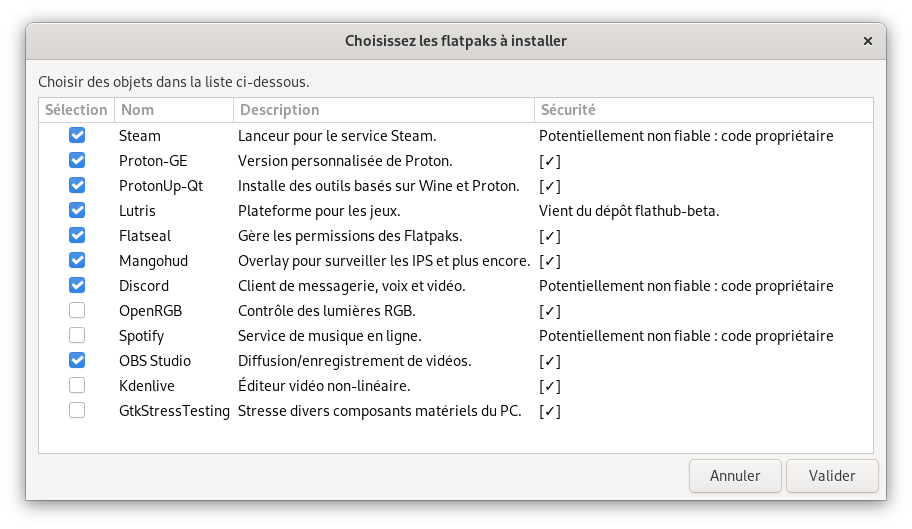
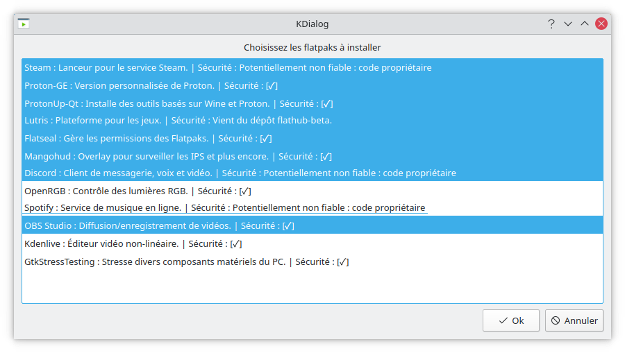
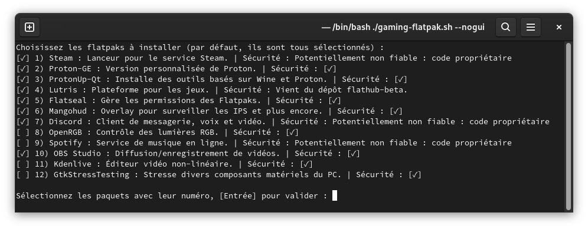

# Gaming-Flatpak
software group in Flatpak/AppImage

## Flatpak and Cie for gaming with fun. [ALPHA] / Flatpak pour le jeu [ALPHA]
Gaming tools on many distributions as possible with Flatpak.

`fr:` Les outils pour jouer sur le plus de distributions possible avec Flatpak.

## You need / Vous avez besoin de :

[Flatpak](https://flatpak.org/setup/)

## Installation
Grab the latest release ".tar.gz" from the right panel and decompress it.
Either double-click the script "gaming-flatpak.sh" directly, or open a terminal in the script's folder and from there :

`$ ./gaming-flatpak.sh`

`fr:` Prenez le dernier ".tar.gz" dans la section "Release" à droite et décompressez le fichier.
Soit vous double-clickez directement sur le script "gaming-flatpak.sh", soit vous ouvrez un terminal dans le dossier où se trouve le script et de là vous tapez :

`$ ./gaming-flatpak.sh`

## Options
```
$ ./gaming-flatpak.sh -h
Utilisation : ./gaming-flatpak.sh [options]
Installe des paquets Flatpak pour le jeu

Options :
  --gui    Force l'utilisation de fenêtres graphiques  (défaut=zenity)
  --gui=VAR  Choisissez 'zenity' ou 'kdialog' pour vos fenêtres
  --nogui    Installation en mode texte
  -h, --help  Écrit cette aide
  -v, --version  Écrit la version et sort
```

## Features / Fonctionnalités
* Install flatpaks, using a special selection for gaming on GNU/Linux.
* `fr:` Installe les flatpaks, avec une sélection taillée pour le jeu sur GNU/Linux.
* Support as much distributions as possible, if it can install flatpak.
* `fr:` supporte la plus part des distributions ; tant qu'elles peuvent installer flatpak.
* Interface for Gnome (Zenity), KDE (Kdialog) and Command line (Bash).
* `fr:` Interface pour Gnome (Zenity), KDE (Kdialog) et la ligne de commande (Bash).




* Multi language support (currently French and mostly English)
* `fr:` Support multi-langues (français et plus ou moins l'anglais)

## Sources:
- https://github.com/flathub/com.valvesoftware.Steam
- https://github.com/GloriousEggroll/proton-ge-custom
- https://github.com/DavidoTek/ProtonUp-Qt
- https://github.com/flathub/net.lutris.Lutris
- https://github.com/tchx84/Flatseal
- https://github.com/flightlessmango/MangoHud
- https://github.com/flathub/com.discordapp.Discord
- https://gitlab.com/CalcProgrammer1/OpenRGB
